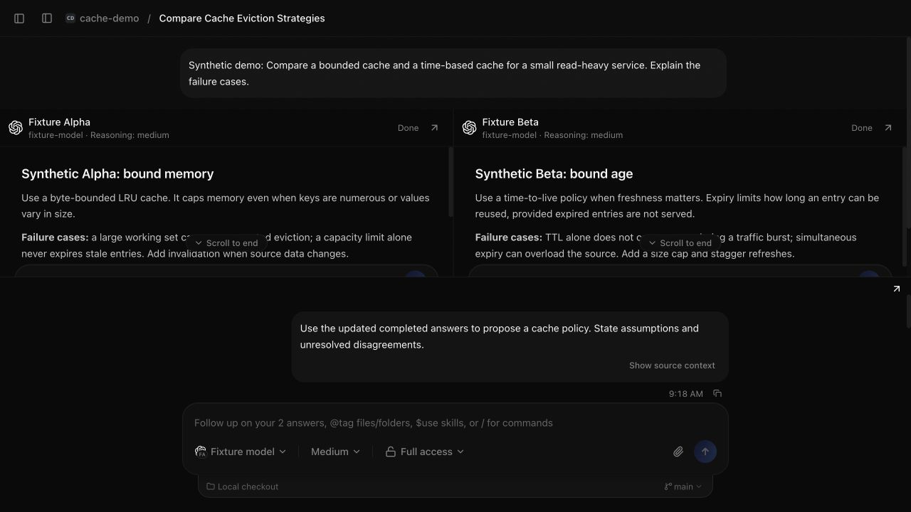
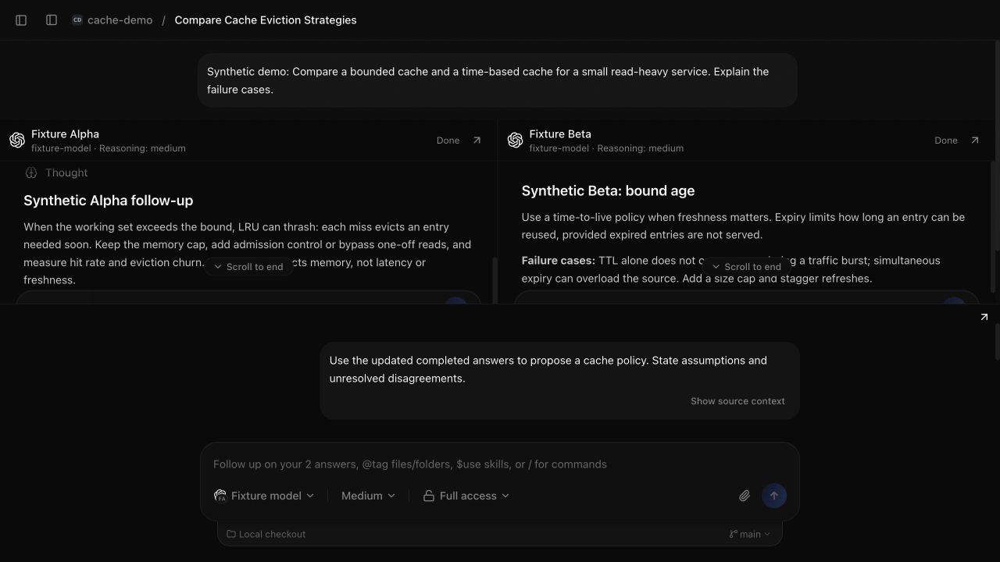
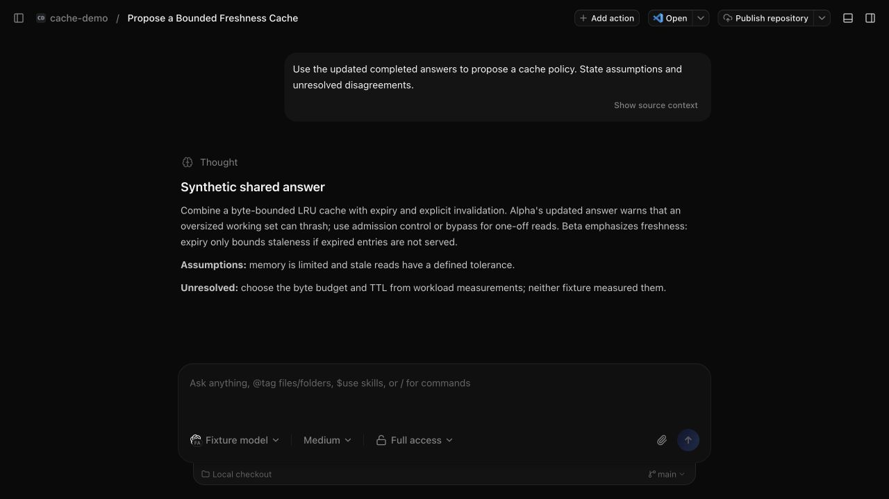

# T3 Compare

Send one prompt to multiple AI providers, explore each conversation independently, and ask a
chosen model to work across their answers. T3 Compare is an independent
[T3 Code](https://github.com/pingdotgg/t3code) fork focused on comparison workflows.

## What the fork adds

- Choose providers, models and supported options for one shared prompt; inspect independent
  responses, native activity, approvals and questions in responsive panes.
- Continue any provider conversation in its pane or full thread. Follow up across the answers
  with a chosen provider; each shared send uses the latest completed source answers as context.
- Keep comparison groups, drafts and provider choices on the current client. Pick the native
  current checkout or separate worktrees without changing provider permissions.

T3 supplies the provider adapters, event-sourced server, typed WebSocket protocol and
web/desktop/mobile foundation. This fork does not establish which model is correct. Different
providers may have different tools, permissions, subscriptions and workspace access.

## Run from source

This candidate is a **source release**. Public Compare binaries and a hosted demo are not
provided. Upstream installers, `npx t3`, Homebrew's `t3-code` and the upstream mobile apps do
not install these comparison changes.

Use Git, Node.js **24.13.1 or later in the 24.x series**, and [Vite+](https://viteplus.dev/guide/).
From a checkout of this repository:

```sh
git clone https://github.com/cliffmin/t3-compare.git
cd t3-compare
vp install --frozen-lockfile
T3CODE_TELEMETRY_ENABLED=false vp run dev --home-dir "$PWD/.t3"
```

Open the local pairing URL printed by the runner; keep its token private. Add a project and
configure providers in Settings. You can inspect the app without sending a prompt. Real
requests require your own authenticated provider and use that provider's subscription or quota.
See [installation and first run](docs/user/install.md) for prerequisites, isolation and limitations,
or [development](docs/operations/development.md) for checks and local desktop builds.

## A short walkthrough

These are **actual app captures with synthetic providers**, not a model evaluation. Fixture Alpha
and Fixture Beta are deterministic local stand-ins for the Codex adapter: both use
`fixture-model`, medium reasoning, Full access and the same disposable current checkout.
They return prepared text, execute no tools and make no paid provider requests. This checks
the workflow; it does not compare real models or their access to tools.

1. Send one shared cache-design prompt. Alpha's prepared answer emphasizes memory bounds;
   Beta's emphasizes freshness.

   

2. Ask Alpha what happens when the working set exceeds the bound. Its conversation continues
   independently while Beta's original answer stays available.

   

3. Choose a model in the shared composer and ask it to propose a policy from the updated
   completed answers. Open that conversation as a full native thread to read the response.
   The captured request contained Alpha's latest follow-up and Beta's original completed answer.

   

The screenshots show selected states from the same interaction, including scrolling back to
read earlier answers; they are not a continuous recording. The prepared shared response does
not prove model reasoning. An owner-written synthesis request uses the shared conversation;
there is no dedicated synthesis mode, differences view, verified winner or claim-level citation
interface. See the [comparison guide](docs/user/composer.md#compare-provider-answers).

## Engineering decisions

Cliff defined the product behavior and acceptance criteria, directed AI-assisted implementation,
and supplied working-app feedback. AI agents implemented and independently reviewed changes;
that review is not a claim of independent human code review.

Two corrections shaped verification. An accepted source retry could still appear terminal until
its new turn was adopted, enabling a shared send too early. The
[pending-state correction](https://github.com/cliffmin/t3-compare/commit/5783330c4)
keeps it pending through adoption, with receipt/restart regression coverage. A pane could also
have plausible geometry yet fail to consume real scrolling. The
[scroll correction](https://github.com/cliffmin/t3-compare/commit/955b2188b)
bounded its height and added a manually invoked real-wheel check. Geometry assertions alone
were insufficient; the wheel check is not automatic CI. These are reliability observations,
not measured speedups or model-quality results.

## Scope and status

The comparison UI targets web and Electron desktop. Local macOS arm64 builds and synthetic
browser interactions have been exercised; this is not verification of every OS, provider or
remote connection mode. Native mobile comparison parity is not claimed. Comparison groups and
preferences are client-local and can be lost when site data is cleared. Shared conversations
use completed answers; availability and context limits remain visible.

Compare.21 includes saved shared-draft reload repair, native aggregate comparison actions,
consolidated worktree-deletion consent and refined Compare controls.
Its macOS arm64 package was locally verified, installed and launched; owner working-app
acceptance and public-release approval remain pending. No passing hosted CI run is
claimed by this document. [Roadmap and limits](docs/roadmap.md) ·
[Fork CI definition](.github/workflows/fork-ci.yml).

The source retains upstream services, including provider/model metadata, CLI update/triage
routes and product analytics. The quickstart disables analytics for its server process;
it does not make all operation offline. Read [inherited services](docs/user/install.md#inherited-services)
before using upstream remote/update/support integrations.

## Contribute and report

Use this fork's [issues](https://github.com/cliffmin/t3-compare/issues) for fork behavior and
feature requests once the repository is public. Include the source revision and a sanitized
reproduction, never credentials, pairing URLs or private conversations. For vulnerabilities,
read the [security reporting policy](.github/SECURITY.md); private reporting must be enabled
and verified before publication. [Contributing](CONTRIBUTING.md) explains focused checks and
AI attribution. [Documentation](docs/README.md) links the inherited architecture and user guides.

T3 Code remains the upstream project. Its code and attribution are retained under the
[MIT license](LICENSE); its adoption and release claims are not claims about this fork.
