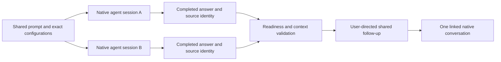

# T3 Compare: coordinating native coding-agent sessions

Compare sends one prompt to selected coding agents, keeps their native conversations side
by side, and lets a chosen provider work across completed answers. The engineering problem
is coordinating independent sessions without losing their identity, state or configuration.

## My contribution

I defined comparison behavior, UI decisions and acceptance criteria, and directed
AI-assisted implementation, debugging and review. [T3 Code](https://github.com/pingdotgg/t3code)
supplies the provider adapters, event-sourced server, typed protocol and application foundation.
The fork adds comparison coordination, presentation, saved grouping and follow-up workflows.
Upstream code and attribution remain under the [MIT license](../../LICENSE).

This is AI-assisted development. Automated checks and independent agent review are evidence
about particular changes; they do not establish human line-by-line review or model accuracy.

## Scatter-gather with native sessions

The scatter step starts independent native conversations with their submitted configuration
and workspace choices. Each conversation can continue on its own. The gather step waits for
source state to permit sending and snapshots eligible completed answers for a user-directed
follow-up. It is not an automatic winner selection or an autonomous agent debate.

| Concern                                             | Implementation to inspect                                                  |
| --------------------------------------------------- | -------------------------------------------------------------------------- |
| Independent launch and native dispatch              | [ChatView](../../apps/web/src/components/ChatView.tsx)                     |
| Group identities, saved state and submission claims | [compareRunStore](../../apps/web/src/compareRunStore.ts)                   |
| Live readiness and shared conversation              | [ComparisonFollowUp](../../apps/web/src/components/ComparisonFollowUp.tsx) |
| Source validation and frozen answer context         | [comparisonFollowUp](../../packages/shared/src/comparisonFollowUp.ts)      |
| Authoritative command validation                    | [server decider](../../apps/server/src/orchestration/decider.ts)           |
| Original-answer identity and recovery               | [comparisonSnapshots](../../apps/web/src/comparisonSnapshots.ts)           |

## Reliability decisions

**Preserve identity across uncertainty.** A later completed turn is not proof that an earlier
launch succeeded. Keep original thread/turn identity and completion evidence. See the
[snapshot regression cases](../../apps/web/src/comparisonSnapshots.test.ts).

**Validate again at send time.** A displayed ready state can become stale. The shared context
builder checks source identity, project membership, changed state and incomplete history;
the server validates the command before dispatch. See the
[shared-context tests](../../packages/shared/src/comparisonFollowUp.test.ts) and
[server follow-up tests](../../apps/server/src/orchestration/decider.comparisonFollowUp.test.ts).

**Make partial results explicit.** Failed or missing sources must not become invented answers.
When the contract permits using available completed answers, disclose missing sources. With
no completed answers, sending stays blocked. Preserve drafts and uncertain delivery rather
than automatically resending. The [requirements](../specs/comparison.md) describe the boundaries.

**Reuse native controls.** Tools, approvals, permissions and worktree behavior belong to each
session. Reusing native execution avoids maintaining a second conversation engine, but means
comparison has to respect existing lifecycle and recovery rules.

## A concrete correction: a failed follow-up must not erase a proven answer

The shared context builder previously omitted an earlier completed answer whenever a later
user request appeared, even when native state confirmed that the new start had failed.
That conservative rule prevented invented success, but also discarded useful proven context.

The correction retains the completed turn only with definitive failed-start evidence and no
pending retry. It labels the frozen context as an earlier completed answer and shows a notice
in the shared composer. It does not claim the failed request completed or recover arbitrary
historical text. Regression cases cover retained answers, stale error evidence, pending retries,
partial results and server-side snapshot validation in the linked tests above.

Independent agent review caught a second issue: changing models before the failed request
could attribute the earlier output to the new selection. The correction explicitly marks the
earlier model/options as unknown when they cannot be proven and records current thread
configuration separately. A regression test exercises that changed-configuration case.

## Verification and delivery

The [README walkthrough](../../README.md#a-short-walkthrough) contains actual app captures
with synthetic providers and prepared answers. Synthetic fixtures support repeatable checks
without exposing private conversations or consuming provider quota. They do not demonstrate
live model reasoning. A live-provider demo has not been recorded yet. The
[28-second recovery recording](https://github.com/cliffmin/t3-compare/releases/download/compare-source-preview-2026-09-29/reliability-recovery.mp4)
shows the failed-start correction in the actual app, using prepared responses and an injected
failure. Setup is trimmed; the remaining sequence runs at original speed without interior cuts.

[Fork CI](../../.github/workflows/fork-ci.yml) checks formatting, lint, types, web build and
configured test suites. Its aggregate job fails when a prerequisite does not pass. The name
of that job alone does not establish that branch protection enforces it. A local test run
also does not establish hosted CI success for an unpublished revision.

For each change, review the bounded diff, regression evidence and affected runtime behavior.
Record actual review and known limits in the change description. Follow the
[contribution policy](../../CONTRIBUTING.md) and [source-release procedure](../operations/release.md).
Local desktop delivery preserves a previous app and offline data/profile backup for rollback;
see [desktop operations](../operations/comparison-desktop.md). The fork does not claim an
automated public desktop deployment pipeline.

## Limits and scaling considerations

This is an early source preview. Comparison groups and preferences are client-local; clearing
site data can remove them. Providers may differ in tools, permissions, models and context, so
side-by-side output is not a controlled benchmark. No adoption, productivity, production-scale
or model-ranking result is claimed.

A multi-user service would need explicit concurrency and quota limits, durable cross-client
coordination, recovery ownership and operational telemetry. Those are design considerations,
not capabilities established by this local comparison workflow. The useful evidence here is
how a bounded orchestration flow handles identity, state changes and partial failure.
